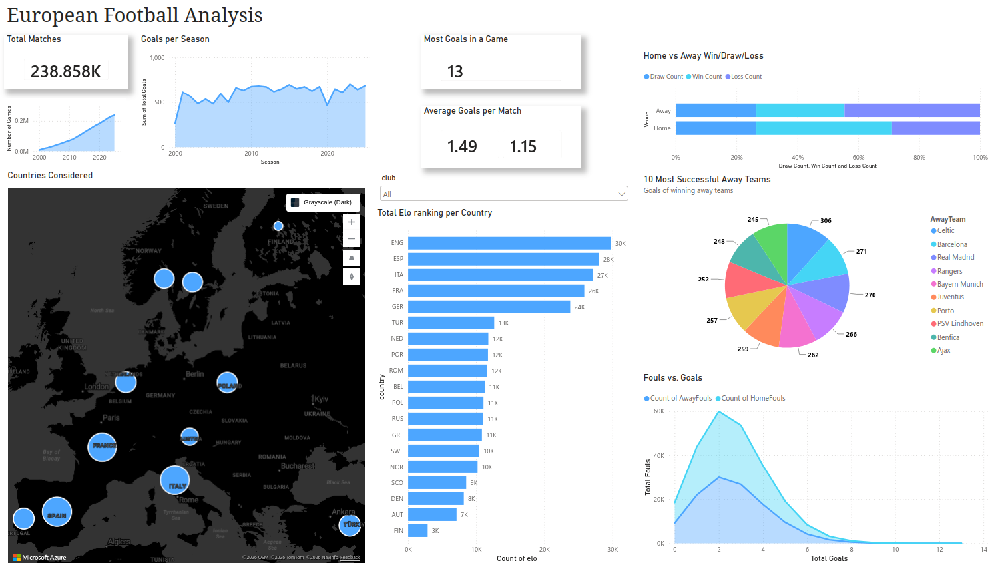

# European Football Analysis Dashboard

## Acknowledgements
This project was built using the data from Gábor, A. (2026), retrieved from https://www.kaggle.com/datasets/adamgbor/club-football-match-data-2000-2025?select=Matches.csv

## 🛡️ License

This project is licensed under the [MIT License](LICENSE). You are free to use, modify, and share this project with proper attribution.

## 🌟 About Me

I'm **Tatiana M. Rodriguez**, a data engineer with a Ph.D. in Physics and a knack for bringing order to chaos. 

Let's stay in touch! Feel free to connect with me on the following platforms:

 

